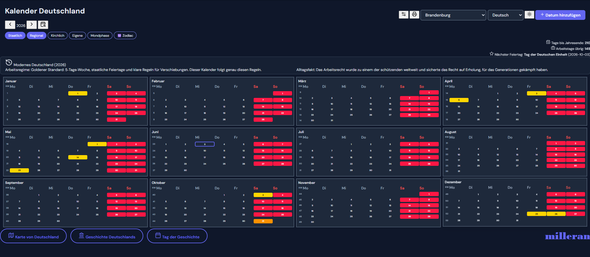

# Kalender Deutschland

Kalender Deutschland is a Chrome extension with a German calendar, federal-state holidays, an interactive Germany map, and a historical cycle about Germany.

The project is designed as an educational and informational browser extension.



## Features

- German calendar with national, regional, and church holidays.
- Region selection for German federal states.
- Theme switch, filters, zodiac and moon phase information.
- Interactive map of Germany with federal states.
- Detailed state view in a separate window.
- History section with 16 periods of German history.
- "Day in History" section with date-based German events.
- Local historical images, maps, flags, and coats of arms.
- Multilingual history texts for 15 languages: German, English, Russian, French, Spanish, Italian, Portuguese, Dutch, Polish, Turkish, Chinese, Japanese, Korean, Hindi, and Arabic.
- Arabic history view supports right-to-left text direction.

## Install In Chrome

1. Open Chrome.
2. Go to `chrome://extensions/`.
3. Enable `Developer mode`.
4. Click `Load unpacked`.
5. Select this folder:

```text
C:\Users\Hyrican\Desktop\calendar\kalender-extension
```

After changes in the code, open `chrome://extensions/` and click `Reload` on the extension card.

## Main Files

- `index.html` - main calendar screen.
- `manifest.json` - Chrome extension manifest.
- `js/app.js` - calendar logic.
- `js/translations.js` - main interface translations.
- `js/atlas.js` - interactive Germany map.
- `js/atlas-data.js` - map labels and state data.
- `atlas-state.html` - detailed federal-state map window.
- `js/history-data.js` - base history data.
- `js/history-extra.js` - extended history text, media, symbols, and translations.
- `js/history.js` - history overlay UI.
- `js/on-this-day.js` - date-based "Day in History" UI.
- `css/history.css` - history section styling.
- `css/on-this-day.css` - "Day in History" section styling.
- `data/on-this-day/` - date-based event files loaded only when needed.
- `assets/history/` - local historical images, maps, flags, and coats of arms.
- `data/geo/` - local geographic data for the Germany map.
- `ATTRIBUTION.md` - notes about map and media sources.

## Sources

Maps and historical media are stored locally in the extension and are intended to come from open sources such as Wikimedia Commons, OpenStreetMap-related tiles, Natural Earth, and open geographic datasets.

See `ATTRIBUTION.md` for source and license notes.

OpenStreetMap map tiles are loaded from:

```text
https://*.tile.openstreetmap.org/
```

When adding new images or maps, use open-access files and keep their filenames clear.

## Distribution

For testing with friends, send the whole extension folder as a ZIP archive. The receiver should unzip it and load it through `chrome://extensions/` using `Load unpacked`.

A link like this works only on the same computer where the extension is installed:

```text
chrome-extension://.../index.html
```

It cannot be used as a public link for other people.

## Notes

This is not an official government or public holiday authority. Dates and historical descriptions should be checked before public release.

Brand mark: `milleran`.

## Day In History Data

The "Day in History" feature uses one JSON file per calendar date:

```text
data/on-this-day/MM-DD.json
```

The preferred event range is 1700-2020. Earlier events can be included when they are important and well documented. Events after 2020 are not included, so the feature stays historical and does not become a news feed.
